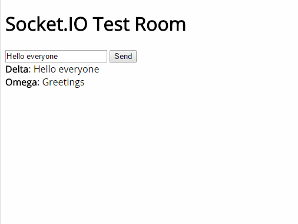

# Socket.IO Instant Messaging Server 
 
Client-side instant messaging application with usernames using Socket.IO. 
 
 
 
## Instructions 

 1. Install Node and npm.
 2. Clone the repository.
 3. Run the server.

 ```sh
 node app.js
 ```